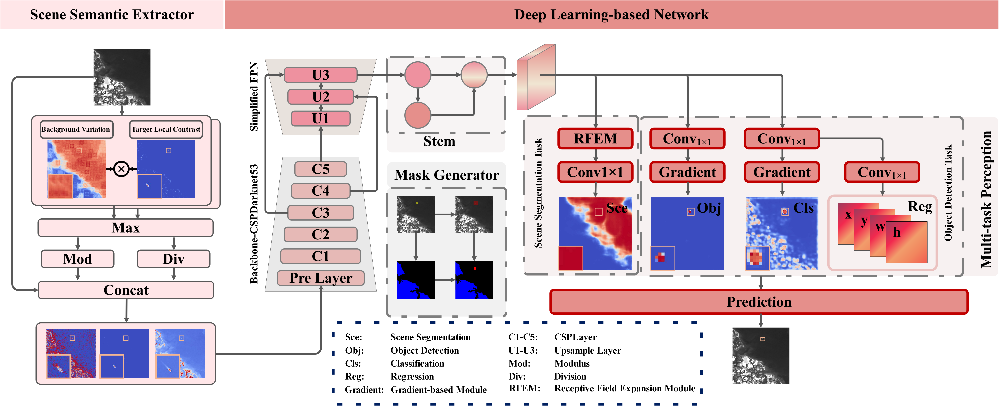

# SMPISD-MTPNet: Scene Semantic Prior-Assisted Infrared Ship Detection Using Multi-Task Perception Networks

## **[IEEE TGRS] Implementation of our paper "SMPISD-MTPNet: Scene Semantic Prior-Assisted Infrared Ship Detection Using Multi-Task Perception Networks". [paper](https://ieeexplore.ieee.org/abstract/document/10802996)**



## Requirement

Please check requirements.txt

## Datasets

Our dataset is here: https://pan.baidu.com/s/1FwSVOrNgu1XJO6EvucWNGA?pwd=hchc
The code is hchc

## Pretraining Weights

Our weights is here: https://pan.baidu.com/s/1tXpmKDyMTyMysqC3TaP8_w?pwd=ymsb

The code is ymsb

## Commands for Training

* **Install the environment according to** `requirements.txt`
* **Check the input.xlsx where there are some settings about our training.**
* **Run launch.py**

```
python launch.py
```

* **Checkpoints and Logs will be saved to training_save**

## Citation

```
@ARTICLE{10802996,
  author={Hu, Chen and Dong, Xiaogang and Huang, Yian and Wang, Lele and Xu, Liang and Pu, Tian and Peng, Zhenming},
  journal={IEEE Transactions on Geoscience and Remote Sensing}, 
  title={SMPISD-MTPNet: Scene Semantic Prior-Assisted Infrared Ship Detection Using Multitask Perception Networks}, 
  year={2025},
  volume={63},
  number={},
  pages={1-14},
  keywords={Marine vehicles;Semantics;Feature extraction;Accuracy;Image segmentation;Object detection;Multitasking;Shape;Synthetic aperture radar;Oceans;Gradient-based module;infrared ship detection (IRSD);multitask perception;scene segmentation;scene semantic prior},
  doi={10.1109/TGRS.2024.3516879}}

```
